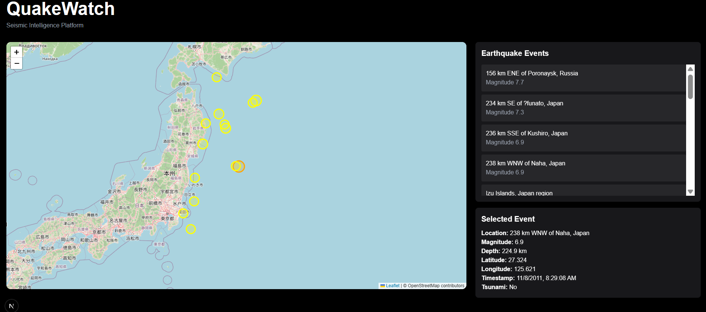
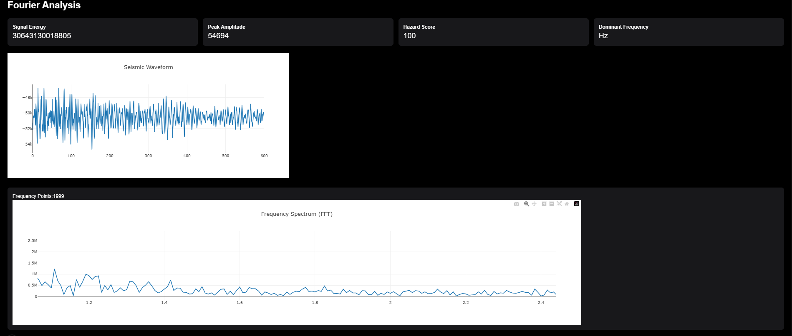

# QuakeWatch

QuakeWatch is a full-stack seismic intelligence platform that combines earthquake monitoring, seismic waveform analysis, frequency-domain signal processing, and impact assessment into a unified dashboard.

The platform enables users to explore earthquake events, analyze seismic waveforms using Fast Fourier Transform (FFT), assess hazard levels, and visualize potential impact zones through interactive geospatial maps.

---

## Overview

Earthquakes generate large volumes of seismic data that are often difficult to interpret quickly during emergency situations.

QuakeWatch bridges this gap by providing:

* Earthquake monitoring dashboard
* Seismic waveform visualization
* FFT-based frequency analysis
* Hazard scoring system
* Risk assessment engine
* Impact radius estimation
* Interactive geospatial visualization

The system transforms raw seismic data into actionable insights that can support disaster response, risk assessment, and educational exploration of seismology.

---

## Features

### Earthquake Monitoring

* Interactive earthquake explorer
* Real-time event visualization
* Magnitude and depth tracking
* Epicenter mapping
* Geographic event exploration
* Tsunami indicator detection

### Seismic Signal Analysis

* Waveform visualization
* Fast Fourier Transform (FFT)
* Dominant frequency extraction
* Frequency spectrum analysis
* Signal energy computation
* Peak amplitude detection

### Frequency Band Analysis

The platform categorizes seismic energy into:

* Low Frequency (0–1 Hz)
* Mid Frequency (1–5 Hz)
* High Frequency (5+ Hz)

This allows rapid identification of energy distribution patterns within seismic events.

### Hazard Assessment

* Automated hazard scoring
* Risk classification engine
* Earthquake severity estimation
* Signal-based risk evaluation

Risk categories:

* LOW
* MODERATE
* HIGH
* SEVERE

### Impact Analysis

The Impact Analysis module estimates the potential influence region of an earthquake using magnitude and event metadata.

Generated metrics include:

* Affected Radius
* Evacuation Radius
* Estimated Impact Area
* Epicenter Coordinates
* Tsunami Risk Assessment

### Geospatial Visualization

Interactive mapping includes:

* Earthquake epicenter visualization
* Impact radius overlays
* Evacuation zone overlays
* Geographic risk representation
* Interactive zoom and navigation

---

## System Architecture

```text
                    ┌─────────────────────┐
                    │  Earthquake Dataset │
                    └──────────┬──────────┘
                               │
                               ▼
                    ┌─────────────────────┐
                    │      MongoDB        │
                    └──────────┬──────────┘
                               │
                               ▼
                    ┌─────────────────────┐
                    │      FastAPI        │
                    │   Backend Engine    │
                    └──────────┬──────────┘
                               │
       ┌───────────────────────┼───────────────────────┐
       ▼                       ▼                       ▼
 Waveform Analysis      FFT Processing      Impact Analysis
       │                       │                       │
       └───────────────┬───────┴───────────────┬───────┘
                       ▼                       ▼
                Next.js Dashboard      Interactive Maps
```

---

## Technology Stack

| Layer             | Technologies               |
| ----------------- | -------------------------- |
| Frontend          | Next.js, React, TypeScript |
| Backend           | FastAPI, Python            |
| Database          | MongoDB Atlas              |
| Mapping           | Leaflet, React Leaflet     |
| Visualization     | Plotly                     |
| Signal Processing | NumPy, SciPy               |
| Styling           | Tailwind CSS               |
| Deployment        | Vercel / Render            |

---

## Project Structure

```text
QuakeWatch
│
├── backend
│   ├── main.py
│   ├── seismic.py
│   ├── database.py
│   └── requirements.txt
│
├── frontend
│   ├── app
│   │   ├── page.tsx
│   │   ├── layout.tsx
│   │   └── globals.css
│   │
│   ├── components
│   │   ├── EarthquakeMap.tsx
│   │   ├── ImpactMap.tsx
│   │   ├── FFTChart.tsx
│   │   └── SeismicChart.tsx
│   │
│   ├── lib
│   │   └── api.ts
│   │
│   └── package.json
│
├── SS
│   ├── list_map.png
│   ├── f_analysis.png
│   └── impact_analysis.png
│
└── README.md
```

---

## Screenshots

### Earthquake Explorer



Browse historical earthquake events and visualize epicenters on an interactive map.

---

### Seismic Frequency Analysis



Perform FFT-based seismic signal analysis and identify dominant frequencies and energy distribution.

---

### Impact Analysis Dashboard


Assess earthquake severity using:

* Risk classification
* Affected radius estimation
* Evacuation radius estimation
* Impact area computation
* Interactive impact visualization

---

## Installation

### Clone Repository

```bash
git clone https://github.com/your-username/QuakeWatch.git

cd QuakeWatch
```

---

## Backend Setup

```bash
cd backend

pip install -r requirements.txt

uvicorn main:app --reload
```

Backend:

```text
http://localhost:8000
```

---

## Frontend Setup

```bash
cd frontend

npm install

npm run dev
```

Frontend:

```text
http://localhost:3000
```

---

## API Endpoints

### Get All Earthquakes

```http
GET /earthquakes
```

### Get Earthquake Details

```http
GET /earthquake/{quake_id}
```

### Analyze Earthquake

```http
GET /analyze-earthquake/{quake_id}
```

Returns:

* Waveform Data
* FFT Spectrum
* Frequency Bands
* Dominant Frequencies
* Hazard Score
* Impact Analysis

---

## Future Enhancements

* Population impact estimation
* Real-time USGS integration
* AI-based damage prediction
* Emergency alert system
* Infrastructure vulnerability analysis
* Historical trend forecasting

---


## License

This project is intended for academic, educational, and research purposes.
